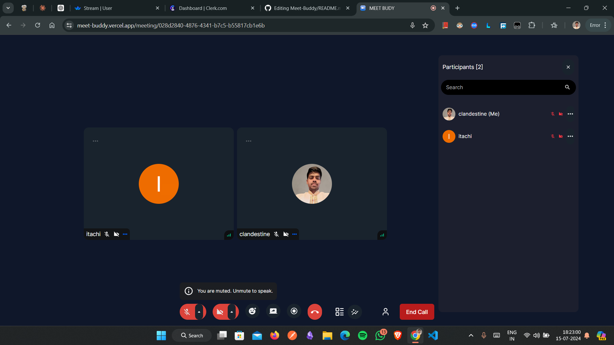

# Project Name

MEET BUUDY - AN ONLINE VIDEO CALLING PLATFORM

## Tech Stack Used

### 
[Next.js](https://nextjs.org/) is a powerful React framework that provides an optimized environment for building server-rendered and static web applications.


### 
[Stream](https://getstream.io/) provides APIs and SDKs to build scalable feeds, chat, and activity streams.


### 
[Clerk](https://clerk.dev/) is an authentication solution designed for modern web applications.


## Features

- **Online Meeting:** Host and join online meetings with real-time video and voice communication.
- **Personal Room:** Create your meeting rooms with unique URLs for easy access and sharing.
- **call stats:** Stay updated with personalized call stats.

## Getting Started

First, run the development server:

```bash
npm run dev
# or
yarn dev
# or
pnpm dev
# or
bun dev
```

Open [http://localhost:3000](http://localhost:3000) with your browser to see the result.

You can start editing the page by modifying `app/page.tsx`. The page auto-updates as you edit the file.

This project uses [`next/font`](https://nextjs.org/docs/basic-features/font-optimization) to automatically optimize and load Inter, a custom Google Font.

